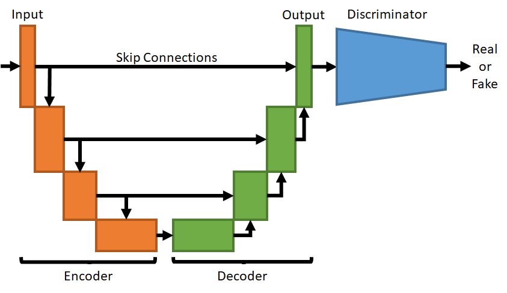

# pix2pix with GAN
## Description
___
This model transforms people's faces into a comic.
___
### Architecture
Using the PyTorch library, the pix2pix GAN architecture was implemented: 
1) U-net was used as a generator for images with a resolution of 128x128;
2) A classical neural network with convolution in the last layer (PathGAN architecture) was used as a discriminator

### Dataset
[Comic faces (paired, synthetic)](https://www.kaggle.com/datasets/defileroff/comic-faces-paired-synthetic) was used as a dataset:

### Learning
During the training, nn.L1Loss() (Mean Absolute Error) and nn.BCEWithLogitsLoss() were used.

torch.optim.Adam() was used as optimazer.

