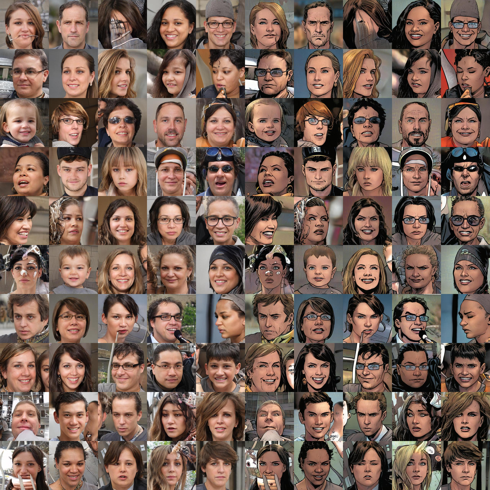

# pix2pix with GAN
## Description
___
This model transforms people's faces into a comic.
___
### Architecture
Using the PyTorch library, the pix2pix GAN architecture was implemented: 
1) U-net was used as a generator for images with a resolution of 128x128;
2) A classical neural network with convolution in the last layer (PathGAN architecture) was used as a discriminator

### Dataset
[Comic faces (paired, synthetic)](https://www.kaggle.com/datasets/defileroff/comic-faces-paired-synthetic) was used as a dataset:

### Learning
During the training, [nn.L1Loss()](https://pytorch.org/docs/stable/generated/torch.nn.L1Loss.html) (Mean Absolute Error) and [nn.BCEWithLogitsLoss()](https://pytorch.org/docs/stable/generated/torch.nn.BCEWithLogitsLoss.html) were used.

[torch.optim.Adam()](https://pytorch.org/docs/stable/generated/torch.optim.Adam.html) was used as optimazer.

> Start training:

> During training:

> End of training:

...

## Usage
In the arguments of the load_model method, after the model, specify the paths to the [discriminator and generator weights](https://www.kaggle.com/datasets/markovka/pix2pix128)

Run file bot.py
1. In console of your computer
2. In cell of notebook (.ipynb) (example: `!python3 /kaggle/input/gan-tg-bot/bot.py`)
